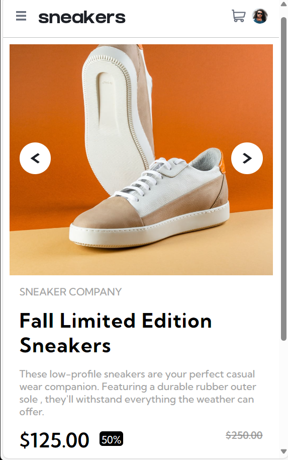

# Frontend Mentor - E-commerce product page solution

This is a solution to the [E-commerce product page challenge on Frontend Mentor](https://www.frontendmentor.io/challenges/ecommerce-product-page-UPsZ9MJp6). Frontend Mentor challenges help you improve your coding skills by building realistic projects.

## Table of contents

  - [The challenge](#the-challenge)
  - [Screenshot](#screenshot)
  - [Links](#links)
-    [Author](#author)

**Note: Delete this note and update the table of contents based on what sections you keep.**

## Overview

### The challenge

The features available on this website include:

- Adaptive layout that optimizes the site for any device screen size.
- Hover states for all interactive elements, enhancing user experience.
- Lightbox gallery that opens when clicking on the large product image.
- Ability to switch the large product image by clicking on small thumbnail images.
- Option to add items to the cart.

### Screenshot

.png>)

### Links

- Solution URL: [Add solution URL here](https://your-solution-url.com)
- Live Site URL: [Add live site URL here](https://your-live-site-url.com)

## My process

### Built with

- Semantic HTML5 markup
- CSS custom properties
- Flexbox
- Mobile-first workflow

## Author

- Website - [Nirmal kumar](https://www.your-site.com)
- Frontend Mentor - [@nirmal-coder](https://www.frontendmentor.io/profile/nirmal-coder)

